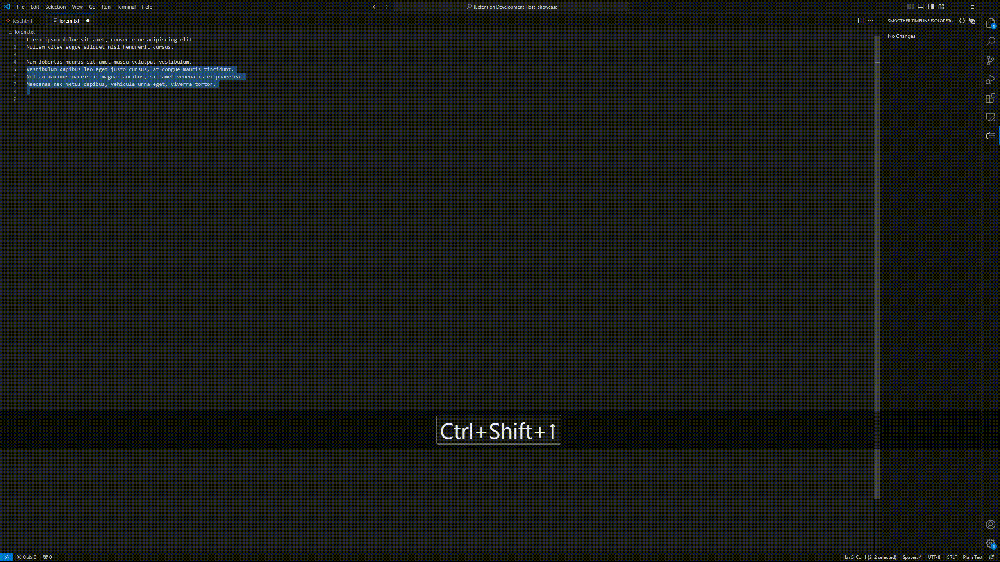

# Prototype Smoother timeline

This is a recreation of the timeline feature of vscode because its missing some key features that I need and the file comparator isnt really nice  
The code is a mess but its good enough, this extension will be deprecated when the proposed api for the timeline release  

You can look it up right here

- [Proposed timeline](https://github.com/microsoft/vscode/blob/main/src/vscode-dts/vscode.proposed.timeline.d.ts)
- [Github issue](https://github.com/microsoft/vscode/issues/84297)

If the proposed api never release I might remake this extension into something way cleaner

If you use this extension, you might want to deactivate the real timeline of vscode by adding this line in your **settings.json**
```json
"workbench.localHistory.enabled": false
```

<!-- 
 -->
<!-- 2560x1440 -->
## Timeline


- includes Save, Undo and Redo point
 
## Compare


- Keep comparing with the original file