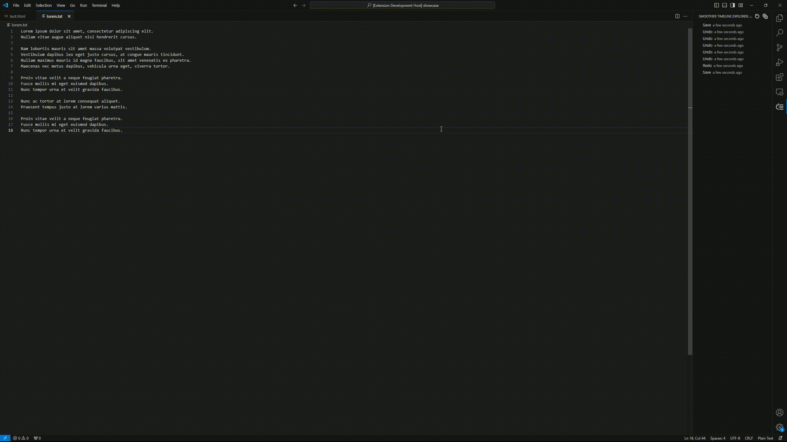

# Prototype: Smoother timeline

This extension is a recreation of the timeline feature in VSCode, addressing missing key features and improving the file comparison experience.  
While the code is currently mess, it serves its purpose for my personal use. This extension will be deprecated once the proposed API for the timeline is released.  

For more details on the proposed timeline API, you can look it up right here:

- [Proposed timeline](https://github.com/microsoft/vscode/blob/main/src/vscode-dts/vscode.proposed.timeline.d.ts)
- [Github issue](https://github.com/microsoft/vscode/issues/84297)

If the proposed API is never released, I will to rewrite this extension.

## Disabling VSCode's Native Timeline
You might want to deactivate VSCode's built-in timeline by adding the following line to your **settings.json**
```json
"workbench.localHistory.enabled": false
```

## Features
### Timeline


- Includes Save, Undo, and Redo points.
 
### Compare


- Continuously compare with the original file.